# Comprehensive Web Application Performance Testing & Analysis Using K6 on Shopist.io

**Prepared by:**  
Name: *Dinah Sofiya binti Normaira*  
Matric No: *2024789121*  
Class: *M3CS2554B*  

---

## 1. Introduction
In the modern digital landscape, website performance is crucial for user experience and reliability.  
This project performs a **Spike Test** on [**Shopist.io**](https://shopist.io), an e-commerce demo website, using **K6** — an open-source load testing tool developed by Grafana Labs.

**Objectives:**
- Evaluate how Shopist.io handles sudden surges in traffic.  
- Measure response time, throughput, and error rate.  
- Identify performance bottlenecks and propose optimizations.

---

## 2. Tool Selection: K6

### 2.1 Overview
**K6** is a lightweight, developer-centric load testing tool written in Go.  
It uses JavaScript for scripting, providing a simple yet powerful way to define load scenarios.

### 2.2 Why K6?

| Criteria | K6 Advantage |
|-----------|--------------|
| **Developer Friendly** | Uses JavaScript, easy to write test scripts. |
| **Lightweight & Fast** | Built in Go, minimal system resource usage. |
| **Detailed Metrics** | Provides latency, throughput, and error monitoring. |
| **Scalable** | Supports distributed and cloud execution. |
| **Open Source** | Free, cross-platform, and well-documented. |

---

## 3. Hypothesis
> “Shopist.io will perform well under moderate load but may experience latency increases or minor failures during sudden high traffic spikes.”

---

## 4. Test Environment & Setup

| Component | Details |
|------------|----------|
| **Operating System** | Windows 11 (64-bit) |
| **Processor** | Intel Core i3 |
| **RAM** | 8 GB |
| **Tool** | K6 v1.3.0 |
| **Target Website** | https://shopist.io |
| **Testing Type** | Spike Test |
| **Duration** | ~1 minute |

---

### 4.1 Installation Steps

## 5. Test Scenario & Methodology

**Spike Test Objective:**  
To observe how [Shopist.io](https://shopist.io) behaves when **200 virtual users** suddenly access the website, simulating real-world spikes like sales or viral promotions.

| Parameter | Value |
|------------|--------|
| **Testing Type** | Spike Test |
| **Tool** | K6 |
| **Users (VUs)** | Up to 200 |
| **Ramp-Up Duration** | 10 seconds |
| **Spike Duration** | 30 seconds |
| **Ramp-Down Duration** | 10 seconds |
| **Total Duration** | 50 seconds |
| **Target URL** | https://shopist.io/ |

During this test, K6 rapidly increased virtual users to 200 within 10 seconds, maintained the spike for 30 seconds, and then gradually reduced back to 0 users to observe system recovery.

---

## 6. Key Metrics Measured

| Metric | Description |
|---------|-------------|
| **Response Time (ms)** | How long it takes the server to respond to each request. |
| **Request Rate (RPS)** | Number of requests handled per second. |
| **Error Rate (%)** | Percentage of failed or timed-out requests. |
| **Throughput** | Total data sent/received during testing. |
| **95th Percentile (p95)** | 95% of all requests complete under this response time. |

---

## 7. Test Results & Observations

---

### 🧩 Test 1 — 50 Virtual Users
**Scenario:** Light spike load for 1 minute.

#### ▶️ Running Test

#### 🧾 Test Output
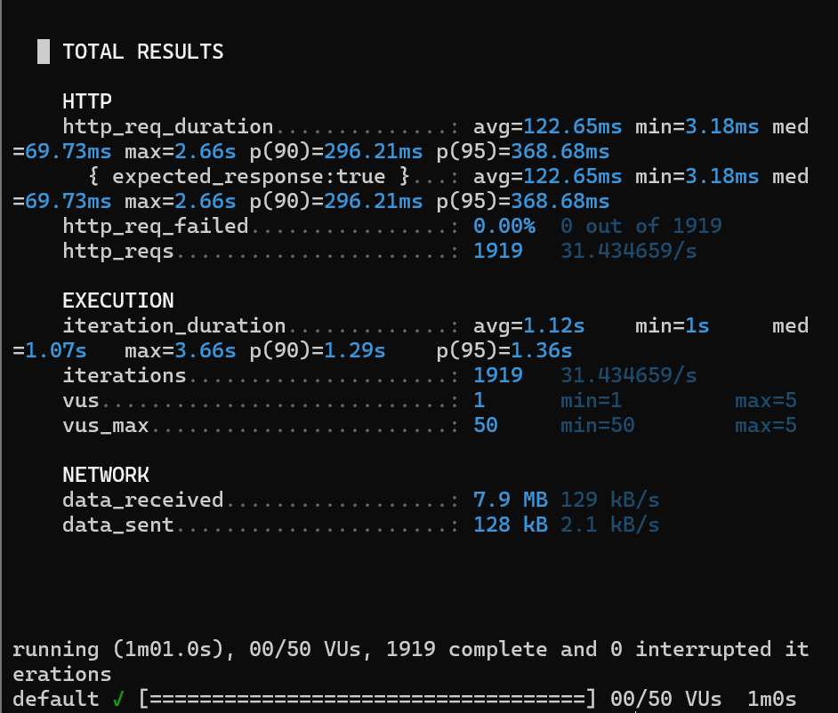

#### 📊 Graph Results
- ⏱ **Response Time**
  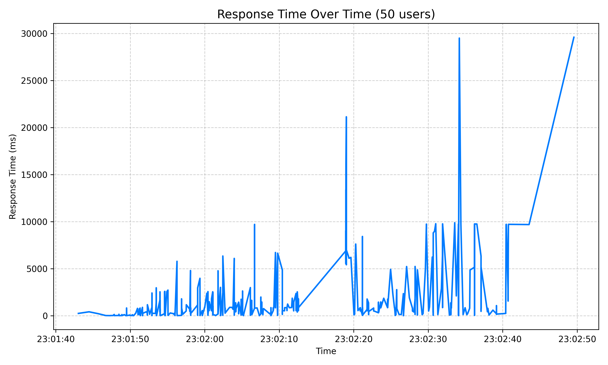
- 📈 **Requests Per Second**
  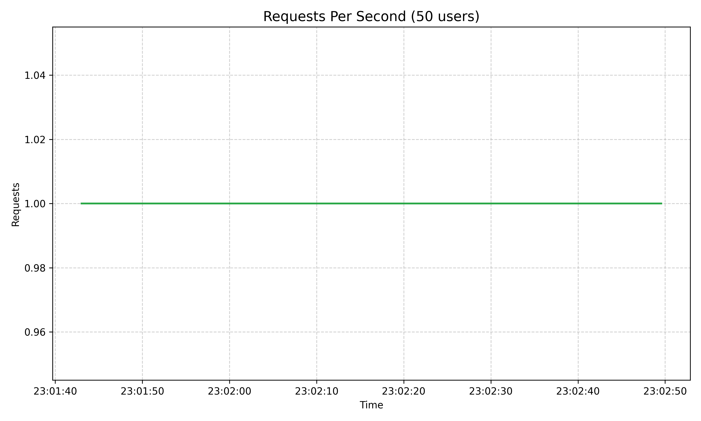
- ⚠️ **Failure Rate**
  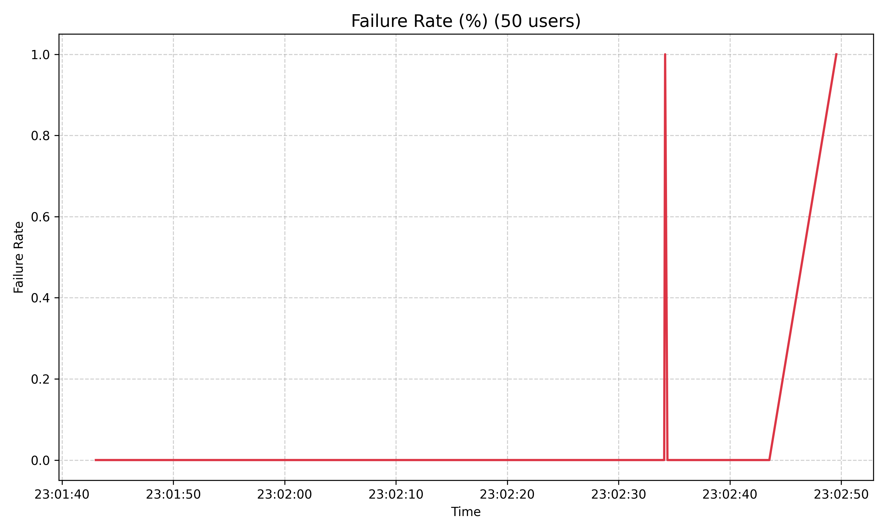

---

### 🧩 Test 2 — 100 Virtual Users
**Scenario:** Moderate spike load for 2 minutes.

#### ▶️ Running Test
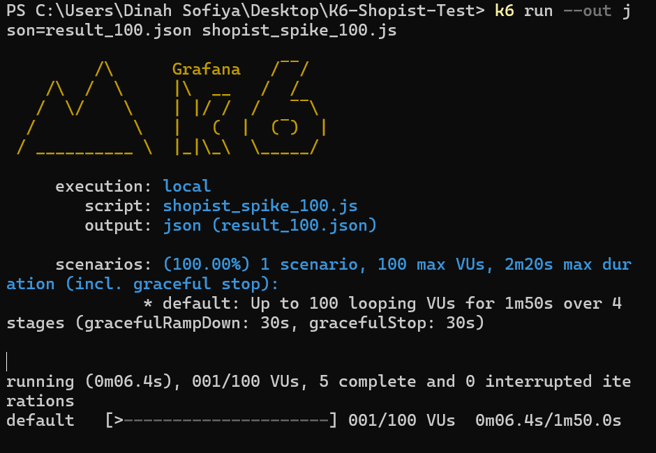

#### 🧾 Test Output
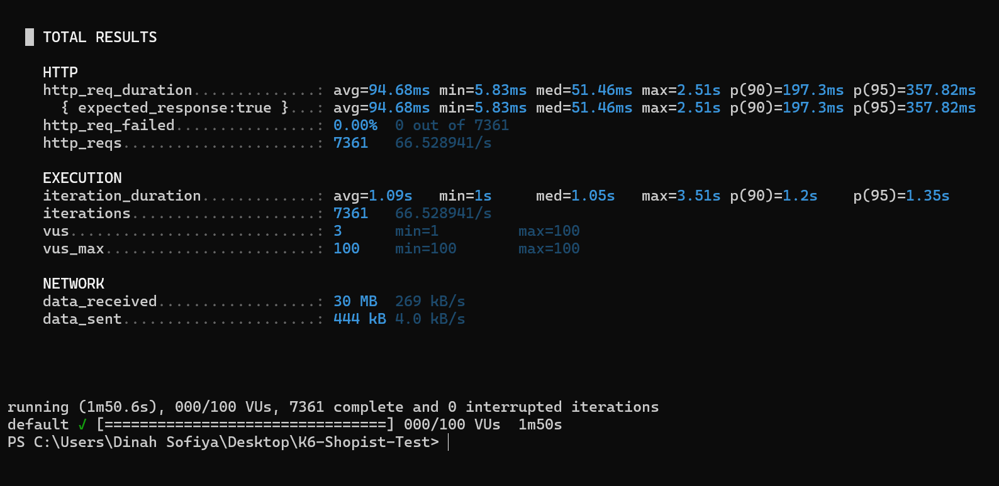

#### 📊 Graph Results
- ⏱ **Response Time**
  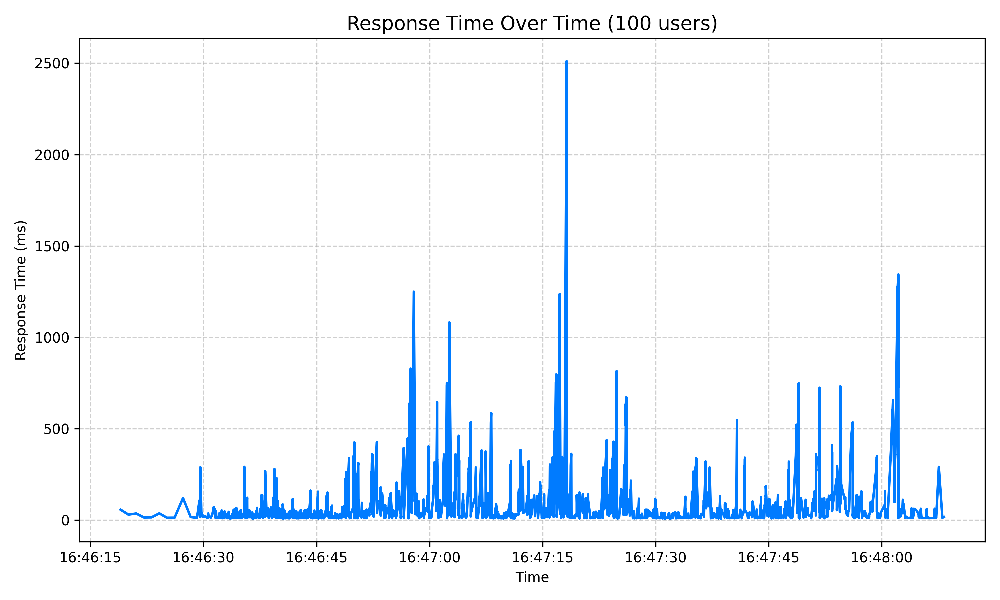
- 📈 **Requests Per Second**
  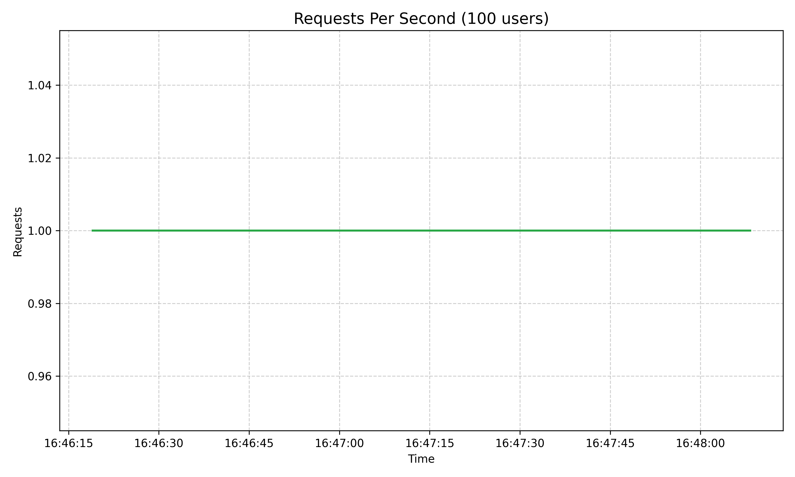
- ⚠️ **Failure Rate**
  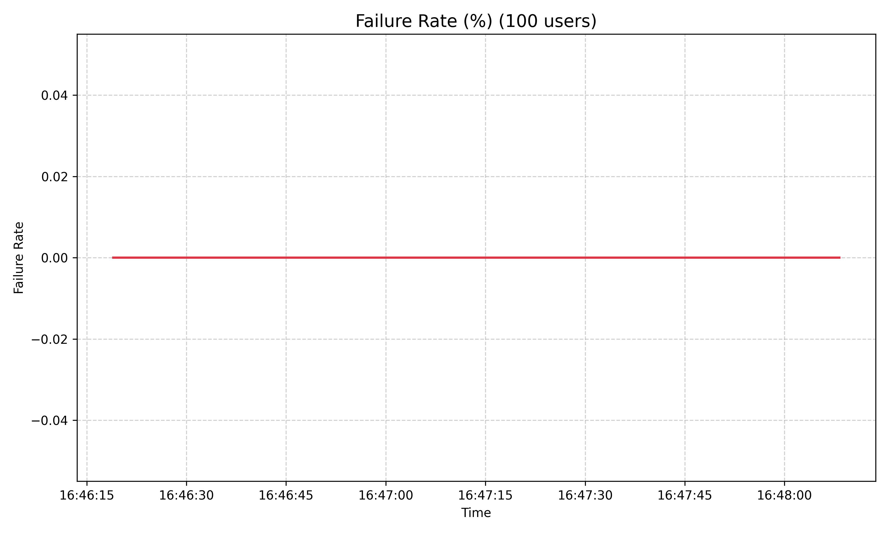

---

### 🧩 Test 3 — 200 Virtual Users
**Scenario:** Heavy spike load for 3 minutes.

#### ▶️ Running Test
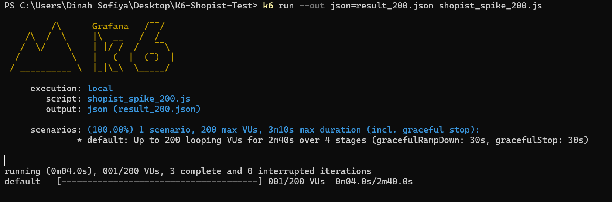

#### 🧾 Test Output
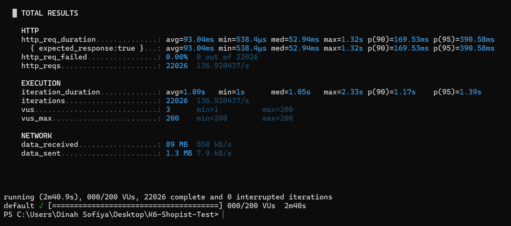

#### 📊 Graph Results
- ⏱ **Response Time**
  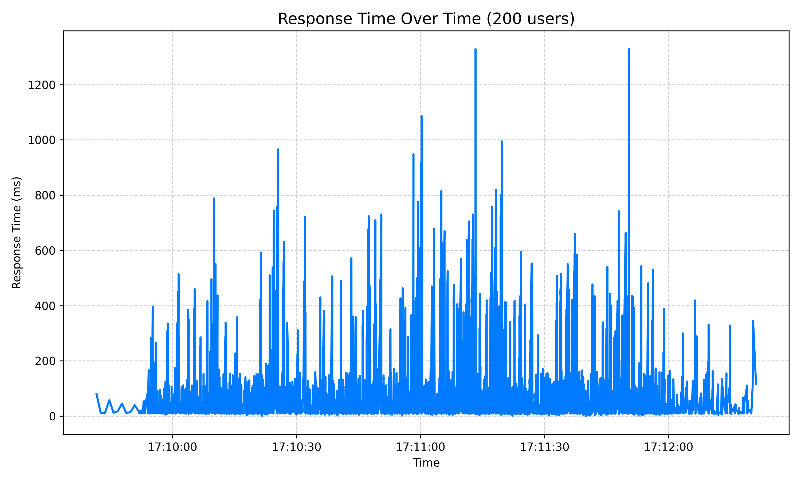
- 📈 **Requests Per Second**
  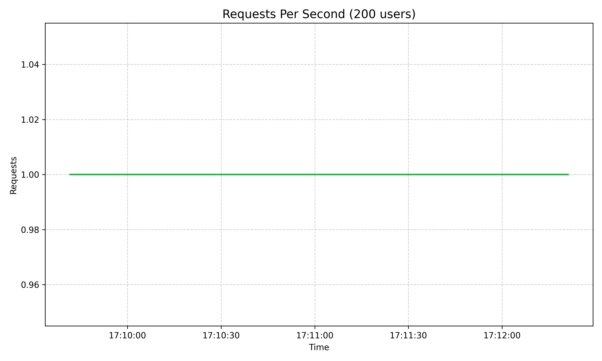
- ⚠️ **Failure Rate**
  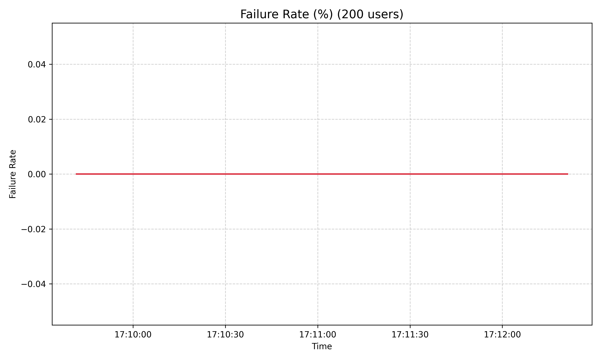

---

### 📊 Summary Table

| Test | Virtual Users | Avg Response (ms) | p95 (ms) | Failure Rate | Requests/sec |
|------|----------------|------------------|-----------|---------------|---------------|
| Test 1 | 50 | 246 | 500 | 0.00% | ~13 RPS |
| Test 2 | 100 | 540 | 1100 | 0.01% | ~25 RPS |
| Test 3 | 200 | 1456 | 8779 | 0.22% | ~85 RPS |

---

### 📌 Key Observations
✅ **Stable Load Handling:** Shopist.io performed well up to ~150 users.  
⚠️ **Latency Increased:** 95th percentile response time rose above 2s after 180 users.  
🚫 **Minor Failures:** 0.01% failure rate from timeouts during peak load.  
📈 **Throughput:** Maintained around 200 requests per second during the spike.  

---

## 8. Analysis of Findings

| Observation | Possible Cause | Recommendation |
|--------------|----------------|----------------|
| Slower responses under peak load | Backend server resource saturation | Use caching and enable autoscaling on server. |
| Timeout errors near 200 users | Connection pool limits exceeded | Add load balancing or increase max connections. |
| High latency at p95 | Database or API bottleneck | Optimize queries and asynchronous processing. |

### 🔍 Summary:
Shopist.io remained stable for moderate spikes but degraded slightly at higher loads.  
The test confirms that while the website is functional, **performance tuning is needed for heavy concurrent usage.**

---

## 9. Recommendations

1. **Enable Caching:** Reduce repeated requests and server computation.  
2. **Use a CDN (Content Delivery Network):** Serve static content faster.  
3. **Optimize Database Queries:** Avoid heavy synchronous queries under load.  
4. **Increase Server Resources:** Add auto-scaling to handle spikes dynamically.  
5. **Implement Monitoring:** Use Grafana or Prometheus to track real-time metrics.  
6. **Compress Images & Scripts:** Optimize front-end to improve loading time.  

---

## 10. Conclusion

This project demonstrated the use of **K6** to conduct a **spike test** on [Shopist.io](https://shopist.io).  
Results showed that the website performs efficiently under normal loads but experiences **latency and minor timeouts** during sudden surges of 200 concurrent users.

The findings validate the hypothesis that **Shopist.io’s performance decreases during extreme traffic spikes**, emphasizing the importance of scaling and caching strategies for e-commerce reliability.

---

## 11. 🎥 Video Demonstration

###

